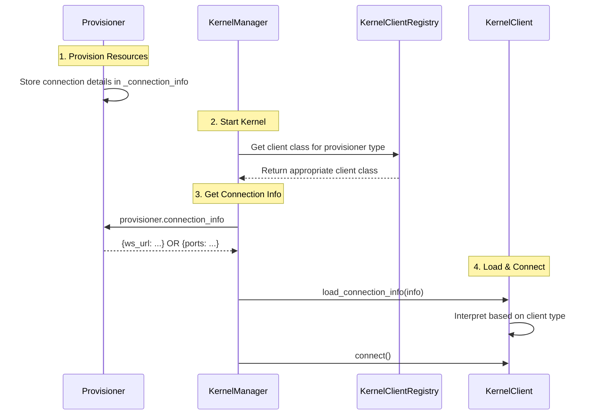

# Connection Info Pattern: Extensible Provisioner Communication

## Overview

This document describes the extensible connection_info pattern that enables generic communication between KernelManager, Provisioner, and KernelClient components.

## Problem Statement

Previously, different provisioner types handled connection information inconsistently:

- **LocalProvisioner**: Set ZMQ ports directly on KernelManager attributes
- **SparkProvisioner**: Generated connection info but KernelManager had to generate WebSocket URL
- **Result**: GatewayKernelManager needed provisioner-specific logic, breaking abstraction

## Solution: Extensible Connection Info Pattern

### Core Principle

**Provisioners are the source of truth** for connection details. The `connection_info` dictionary serves as an extensible data carrier that can contain any connection fields needed by different provisioner types.

### Architecture



## Implementation Details

### 1. KernelManager Delegates to Provisioner

**File**: [`nextgen_kernels_api/services/kernels/kernelmanager.py`](../nextgen_kernels_api/services/kernels/kernelmanager.py)

```python
def get_connection_info(self, session: bool = False) -> dict:
    """Get connection info by delegating to provisioner."""
    if self.provisioner and hasattr(self.provisioner, 'connection_info'):
        # Delegate to provisioner (extensible pattern)
        info = self.provisioner.connection_info.copy()
    else:
        # Fallback: Build from KM attributes (backward compatibility)
        info = {
            "shell_port": self.shell_port,
            "iopub_port": self.iopub_port,
            # ... other ZMQ ports
        }
    
    if session:
        info["key"] = self.session.key
    
    return info
```

### 2. Provisioners Store Connection Info

#### LocalProvisioner (ZMQ Ports)

**File**: `jupyter_client/jupyter_client/provisioning/local_provisioner.py`

Already follows the pattern:
```python
async def pre_launch(self, **kwargs):
    km = self.parent
    km.shell_port = lpc.find_available_port(km.ip)
    # ... allocate other ports
    km.write_connection_file()
    self.connection_info = km.get_connection_info()  # Line 204
    return await super().pre_launch(**kwargs)
```

#### SparkProvisioner (WebSocket URL)

**File**: `jupyter_server/saturn/provisioners/spark_provisioner.py`

Now stores WebSocket connection info:
```python
def __init__(self, **kwargs):
    super().__init__(**kwargs)
    self._connection_info: Dict[str, Any] = {}

async def submit_spark_job(self, **kwargs):
    # ... launch Spark job ...
    
    # Generate WebSocket URL
    self.jupyter_gateway_url = self.spark_url.replace(
        self.submission_id, f"jupyter-gateway-{self.submission_id}"
    )
    
    # Store WebSocket connection info
    km = self.parent
    self._connection_info = {
        "ws_url": self.jupyter_gateway_url,
        "key": km.session.key,
        "signature_scheme": "hmac-sha256",
        "kernel_id": self.kernel_id,
        "submission_id": self.submission_id,
    }

@property
def connection_info(self) -> KernelConnectionInfo:
    """Return WebSocket-based connection info."""
    return self._connection_info
```

### 3. Registry Maps Provisioners to Clients

**File**: [`nextgen_kernels_api/services/kernels/kernel_client_registry.py`](../nextgen_kernels_api/services/kernels/kernel_client_registry.py)

The registry already has comprehensive infrastructure:
```python
# Register mappings
KernelClientRegistry.register(LocalProvisioner, JupyterServerKernelClient)
KernelClientRegistry.register(SparkProvisioner, GatewayKernelClient)

# Get client for provisioner
client_class = KernelClientRegistry.get_client_for_provisioner(provisioner)
```

### 4. ProvisionerAwareKernelManager Uses Registry

**File**: [`nextgen_kernels_api/services/kernels/kernelmanager.py`](../nextgen_kernels_api/services/kernels/kernelmanager.py)

```python
class ProvisionerAwareKernelManager(KernelManager):
    """Generic kernel manager that selects client class based on provisioner type."""
    
    async def _async_start_kernel(self, **kw):
        await super()._async_start_kernel(**kw)
        
        # Select appropriate client class
        if self.provisioner:
            client_class = KernelClientRegistry.get_client_for_provisioner(
                type(self.provisioner)
            )
            if client_class:
                self.client_class = client_class
                self.client_factory = client_class
```

### 5. Clients Interpret Connection Info

#### JupyterServerKernelClient (ZMQ)

Expects ZMQ ports:
```python
def load_connection_info(self, info):
    self.shell_port = info["shell_port"]
    self.iopub_port = info["iopub_port"]
    # ... load other ZMQ ports
```

#### GatewayKernelClient (WebSocket)

**File**: [`nextgen_kernels_api/gateway/managers.py`](../nextgen_kernels_api/gateway/managers.py)

Expects WebSocket URL:
```python
def load_connection_info(self, info: KernelConnectionInfo) -> None:
    """Load WebSocket connection info from provisioner."""
    if "ws_url" not in info:
        raise ValueError(
            "GatewayKernelClient requires 'ws_url' in connection_info."
        )
    
    self.ws_url = info["ws_url"]
    
    if "key" in info:
        key = info["key"]
        if isinstance(key, str):
            key = key.encode()
        if isinstance(key, bytes):
            self.session.key = key
```

## Connection Info Formats

### LocalProvisioner → JupyterServerKernelClient

```python
{
    "shell_port": 54321,
    "iopub_port": 54322,
    "stdin_port": 54323,
    "control_port": 54324,
    "hb_port": 54325,
    "ip": "127.0.0.1",
    "transport": "tcp",
    "signature_scheme": "hmac-sha256",
    "key": b"session-key"  # if session=True
}
```

### SparkProvisioner → GatewayKernelClient

```python
{
    "ws_url": "ws://gateway-server/api/kernels/abc-123/channels",
    "key": b"session-key",
    "signature_scheme": "hmac-sha256",
    "kernel_id": "abc-123",
    "submission_id": "spark-submission-456"
}
```

### Future Provisioners

Can add any fields they need:
```python
# Example: Kubernetes provisioner
{
    "k8s_pod_name": "jupyter-pod-123",
    "k8s_namespace": "default",
    "k8s_service_url": "http://jupyter-pod-123.default.svc.cluster.local:8888",
    "key": b"session-key"
}
```

## Benefits

1. **Generic KernelManager**: No provisioner-specific attributes like `ws_url`
2. **Extensible**: New provisioners add fields without changing KernelManager
3. **Type-Safe**: Registry ensures provisioners pair with compatible clients
4. **Consistent**: All provisioners follow same `connection_info` contract
5. **Backward Compatible**: LocalProvisioner already followed this pattern

## Adding New Provisioner Types

### Step 1: Create Provisioner

```python
class MyProvisioner(KernelProvisionerBase):
    def __init__(self, **kwargs):
        super().__init__(**kwargs)
        self._connection_info = {}
    
    async def launch_kernel(self, cmd, **kwargs):
        # Launch kernel and get connection details
        endpoint_url = await self._start_my_kernel()
        
        # Store in connection_info
        self._connection_info = {
            "my_endpoint": endpoint_url,
            "key": self.parent.session.key,
            # ... any other fields needed
        }
        
        return self.connection_info
    
    @property
    def connection_info(self):
        return self._connection_info
```

### Step 2: Create Client

```python
class MyKernelClient(AsyncKernelClient):
    def load_connection_info(self, info):
        """Load my custom connection info."""
        if "my_endpoint" not in info:
            raise ValueError("MyKernelClient requires 'my_endpoint'")
        
        self.endpoint = info["my_endpoint"]
        
        if "key" in info:
            self.session.key = info["key"]
```

### Step 3: Register Mapping

```python
from nextgen_kernels_api.services.kernels.kernel_client_registry import KernelClientRegistry

KernelClientRegistry.register(MyProvisioner, MyKernelClient)
```

### Step 4: Use ProvisionerAwareKernelManager

```python
kernel_manager = ProvisionerAwareKernelManager(
    provisioner=MyProvisioner()
)
# Will automatically use MyKernelClient
```

## Testing

The pattern can be tested by verifying:

1. **LocalProvisioner still works**: Uses ZMQ ports as before
2. **SparkProvisioner uses WebSocket**: Connection info contains `ws_url`
3. **Registry selects correct client**: 
   - LocalProvisioner → JupyterServerKernelClient
   - SparkProvisioner → GatewayKernelClient
4. **Backward compatibility**: Existing code continues to work

## Troubleshooting

### Issue: Client receives wrong connection_info format

**Solution**: Check that provisioner is registered in KernelClientRegistry:
```python
# Check registered mappings
mappings = KernelClientRegistry.get_registered_mappings()
print(mappings)
```

### Issue: KernelManager generates connection info instead of provisioner

**Solution**: Ensure provisioner has `connection_info` property:
```python
@property
def connection_info(self):
    return self._connection_info
```

### Issue: Client doesn't understand connection_info fields

**Solution**: Ensure provisioner and client are paired correctly in registry and client's `load_connection_info()` method handles the expected fields.

## Related Files

- [`nextgen_kernels_api/services/kernels/kernelmanager.py`](../nextgen_kernels_api/services/kernels/kernelmanager.py) - KernelManager with delegation
- [`nextgen_kernels_api/services/kernels/kernel_client_registry.py`](../nextgen_kernels_api/services/kernels/kernel_client_registry.py) - Registry system
- [`nextgen_kernels_api/gateway/managers.py`](../nextgen_kernels_api/gateway/managers.py) - GatewayKernelClient
- `jupyter_server/saturn/provisioners/spark_provisioner.py` - SparkProvisioner implementation
